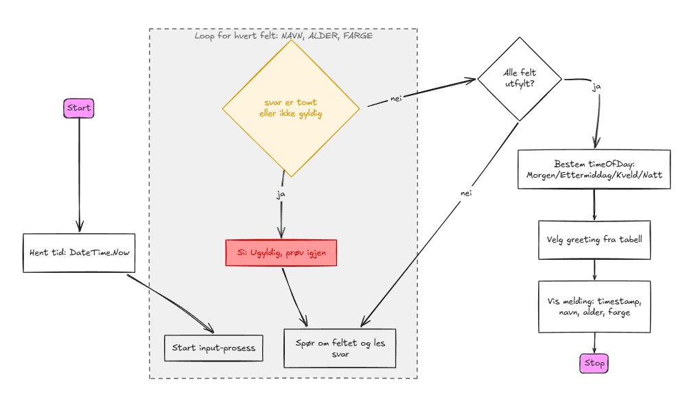

# G.R.E.E.T. ? Greeting Runtime Entry & Evaluation Tool

## Description

A simple console-based program written in C# that provides a personalized greeting based on the current time and user input. The program reads the user's name, age and favourite color, validates input, determines time-of-day (morning/afternoon/evening/night) from the system clock and returns a friendly, localized greeting.



## Features

- **Time-based Greeting**: Chooses a greeting (morning/afternoon/evening/night) based on `DateTime.Now.Hour`.
- **Robust User Input**: Re-asks the user until non-empty values are provided and validates numeric age input.
- **Lookup Table for Greetings**: Uses a `Dictionary` to map time-of-day to localized greetings.
- **Personalized Messages**: Includes timestamp, user's name, age and favourite color in the output.
- **Simple Interface**: Command-line prompts in Norwegian for easy use.

## How to Use

1. **Build the project**:
   ```bash
   dotnet build
   ```

2. **Run the program**:
   ```bash
   dotnet run
   ```

3. **Follow the prompts**:
   - The program will ask for your name, age and favourite color.
   - Type each value and press Enter.
   - The program validates input and then displays a personalized greeting including the current timestamp and time-of-day.

## Program Logic

- Reads the current timestamp from the system clock
- Prompts the user for `navn` (name) and ensures input is not empty
- Prompts the user for `alder` (age) and validates integer parsing and positivity
- Prompts the user for `favorittfarge` (favourite color) and ensures input is not empty
- Determines `timeOfDay` from the current hour (Morgen, Ettermiddag, Kveld, Natt)
- Looks up the localized greeting from a `Dictionary`
- Prints a final, personalized message to the console including timestamp

## Language

This program uses Norwegian language for user interface messages.

---

Files:
- `Program.cs` ? main source file with greeting and input validation logic.

If you want, I can also add a short example output section, translate messages to English, or run the program locally and paste a sample run here.